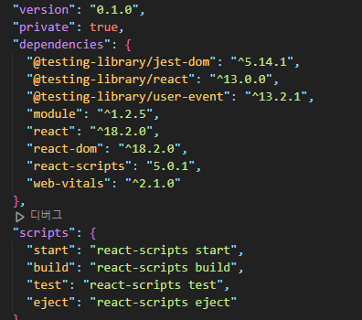
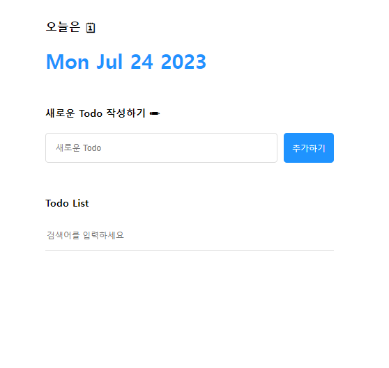
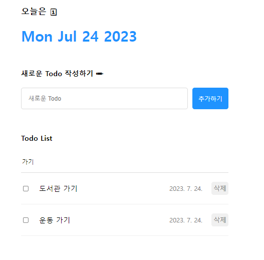

# 리액트 Todo Project - 할 일 목록 만들기

 ### 🗓 프로젝트 제작 기간
<li> 2023.07.12 ~ 2023.07.15 (4일) <br/>

## 💻 모듈

```
> $ cd todo
> $ yarn add module
```

## 💻 실행 

```
> $ yarn start
```

### 💻 기술 스택
<hr/>
 
  
  
  <br><br>

### 📚 구현 기능
<hr/>
✔  오늘 날짜 첫 화면 표시<br>
✔  Todo(할 일 목록) 작성 기능<br>
✔  Todo(할 일 목록) 검색 기능<br>
✔  Todo(할 일 목록) 삭제 기능<br>

## 📝 메인화면
**할 일 목록을 작성, 조회, 삭제를 할 수 있는 메인화면 입니다. **
<br><br>

<li>오늘의 날짜가 헤더 화면에 먼저 출력됩니다
<li> 새로운 할 일 목록을 작성하고 추가할 수 있습니다.
<li> 이미 작성된 목록에서 검색하고자 하는 키워드를 입력해 검색합니다
<li> 삭제하고자 하는 목록은 생성된 게시물의 삭제 버튼을 조작하여 삭제합니다.

## 🔍 검색 기능 상세 화면
**검색 기능 사용 예시를 돕기 위한 화면입니다. **
<br><br>

<li> 이미 작성된 게시물 중에서 찾고자 하는 내용을 입력하여 게시물을 찾습니다.<br>

<br><br>

<li> 특정 키워드를 통한 검색도 가능합니다.
